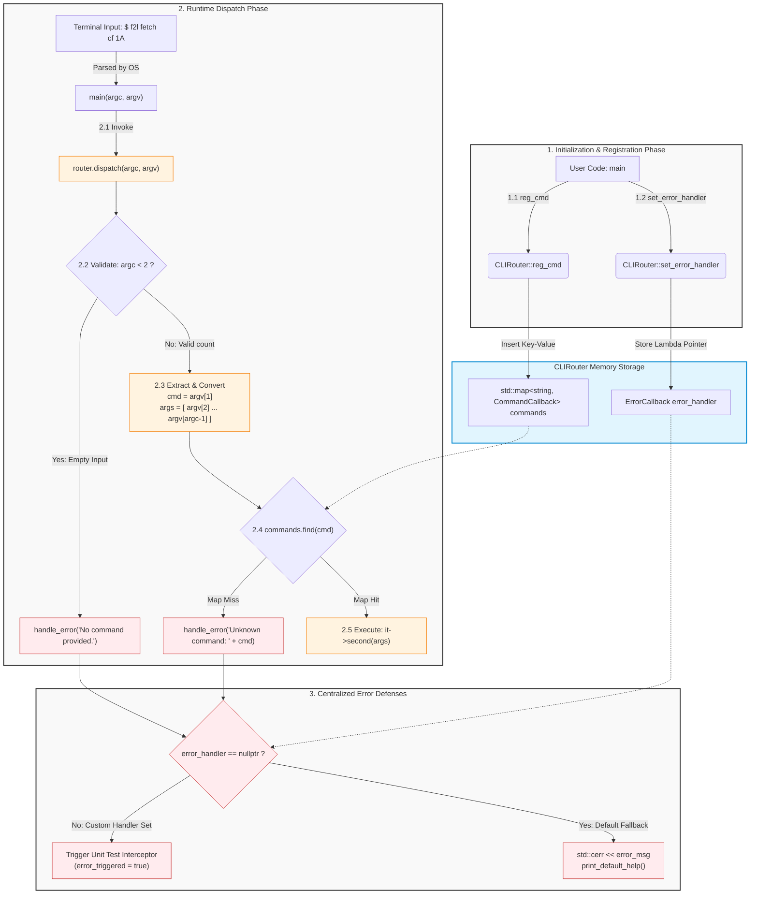

# GG CLIRouter

## What's this

This is the core parameter routing component for a Linux command-line tool implemented in C++\
It provides command registration, dispatch, error handlling capabilities

Here is the CLIRouter core schematic diagram

## Why do this

## How to install

## How to use

## Structure of this

## License
